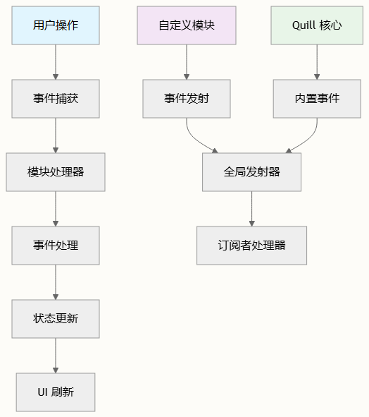

# 事件系统与钩子

TinyEditor 事件系统基于 Quill 的 EventEmitter 模式构建，为处理编辑器交互和自定义模块通信提供了强大的基础。该系统通过全面的钩子机制，使开发者能够拦截、修改和响应各种编辑器状态和用户操作。

## 核心事件架构

TinyEditor 通过类继承结构扩展了 Quill 的原生事件系统，其中主要的 `TinyEditor` 类继承自 `Quill` 并继承了所有事件处理能力。事件系统采用发布者-订阅者模式运行，允许模块发出事件并使组件能够监听特定的编辑器操作。

## 事件发射模式

事件系统支持多种发射模式：

```typescript
// 标准事件发射
this.quill.emitter.on('text-change', handler);
 
// 自定义模块事件
quill.emitter.on(ON_MENTION_LINK_REMOVE, async ({ mention, name }) => {
  // 处理提及删除
});
```

自定义模块利用此系统实现专门功能。例如，Mention 模块使用自定义事件来处理提及链接的删除。

## 模块特定的事件实现

### 剪贴板事件

`CustomClipboard` 模块展示了复制/粘贴操作的高级事件处理：

复制事件：`onCaptureCopy()` 处理带预处理的剪贴板捕获
粘贴事件：`onCapturePaste()` 管理传入内容的处理
内容处理：`onPaste()` 将粘贴内容转换为编辑器兼容格式

### 工具栏状态管理

`BetterToolbar` 模块通过 `update()` 方法实现响应式状态更新，该方法响应选择变化和格式更新。这在 UI 控件和编辑器状态之间创建了双向绑定。

### Mention 系统事件

Mention 模块展示了交互式功能的复杂事件处理：

- 文本变化监控：`handleTextChange` 通过防抖处理响应用户输入
- 自定义事件监听器：`on()` 方法为提及列表交互提供事件委托
- 生命周期事件：提及选择、删除和插入的自定义事件

## 事件流架构



## 钩子集成点

### 文本变化钩子

最基本的钩子是 `text-change` 事件，每当内容修改时触发：

```typescript
quill.on('text-change', (delta, oldDelta, source) => {
  if (source === 'user') {
    // 处理用户发起的更改
  }
});
```

### 选择变化钩子

选择事件启用响应式 UI 更新：

```typescript
quill.on('selection-change', (range, oldRange, source) => {
  if (range) {
    // 用户已选择内容
  }
});
```

### 模块生命周期钩子

模块可以钩接到编辑器初始化和销毁：

```typescript
// 模块注册
TinyEditor.register('modules/customModule', CustomModule);
 
// 带事件绑定的模块初始化
constructor(quill, options) {
  this.quill = quill;
  this.bindEvents();
}
```

## 事件来源分类

TinyEditor 按来源对事件进行分类以实现选择性处理：

| 来源类型 | 描述 | 用例 |
| -- | -- | -- |
| `Quill.sources.USER` |用户发起的操作 | 输入验证、自动保存 |
| `Quill.sources.API` | 程序化更改 | 静默更新、批量操作 |
| `Quill.sources.SILENT` | 内部操作	| 格式保留、撤销/重做 |

> 在处理程序中始终检查事件来源，以避免在响应用户事件以编程方式修改内容时出现无限循环。

## 自定义事件开发

创建自定义模块时，遵循以下事件模式：

1. 定义事件常量：创建唯一的事件标识符
2. 发射事件：使用 `quill.emitter.emit()` 处理自定义事件
3. 处理事件：在相关组件中实现监听器
4. 清理：在模块销毁时移除监听器

```typescript
// 定义自定义事件
const CUSTOM_EVENT = 'custom-module-action';
 
// 发射事件
this.quill.emitter.emit(CUSTOM_EVENT, eventData);
 
// 监听事件
this.quill.emitter.on(CUSTOM_EVENT, this.handleCustomAction);
```

## 性能考虑

事件系统包含针对高频操作的优化：

- 防抖：文本变化处理程序使用 `setTimeout` 批处理快速输入
- 条件处理：范围检查防止不必要的计算
- 事件清理：适当的监听器移除防止内存泄漏

> 为文本变化处理程序中的昂贵操作实现防抖，以在快速输入期间保持编辑器响应性。

## 与协作编辑的集成

协作编辑模块扩展了事件系统以处理实时同步，使用自定义事件进行感知更新和冲突解决。这展示了事件系统在复杂多用户场景中的可扩展性。

有关全面的 API 详细信息和特定事件签名，请参阅 [TinyEditor API 方法](./fluent-editor-instance.md) 文档。要了解模块如何与事件系统集成，请参阅 [模块注册和配置](../docs/module-registration-and-configuration.md)。
