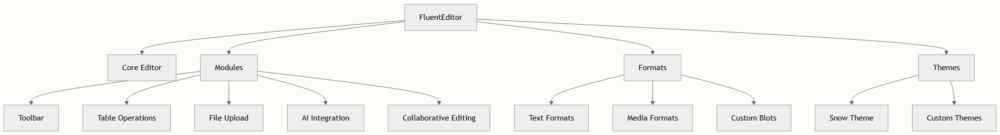

# 基础使用示例

本指南提供了 TinyEditor 入门的综合示例，涵盖了面向初学者开发者的基本实现模式和常见用例。

## 快速开始实现

初始化 TinyEditor 最基本的方法是通过容器元素和配置选项创建新实例：

```javascript
import TinyEditor from '@opentiny/fluent-editor'
 
const editor = new TinyEditor('#editor', {
  theme: 'snow',
  modules: {
    toolbar: [
      ['bold', 'italic', 'underline'],
      ['link', 'blockquote'],
      [{ list: 'ordered' }, { list: 'bullet' }]
    ]
  }
})
```

## 核心架构概述

TinyEditor 扩展了 Quill.js，提供了增强的模块和功能。该架构采用模块化设计，每个功能都作为独立模块实现：



## 基本配置示例

### 基本文本编辑器设置

创建带有基本格式化工具的简单文本编辑器：

```typescript
const basicEditor = new TinyEditor('#editor', {
  theme: 'snow',
  modules: {
    toolbar: [
      ['undo', 'redo'],
      ['bold', 'italic', 'strike', 'underline'],
      [{ script: 'super' }, { script: 'sub' }],
      [{ color: [] }, { background: [] }],
      [{ list: 'ordered' }, { list: 'bullet' }],
      ['link', 'blockquote', 'code-block']
    ]
  }
})
```

### 带表格的高级编辑器

对于需要表格功能的更复杂文档：

```javascript
import { generateTableUp } from '@opentiny/fluent-editor'
import { TableUp, createSelectBox } from 'quill-table-up'
 
TinyEditor.register({ 
  'modules/table-up': generateTableUp(TableUp) 
}, true)
 
const advancedEditor = new TinyEditor('#editor', {
  theme: 'snow',
  modules: {
    toolbar: [
      ['undo', 'redo', 'format-painter', 'clean'],
      [
        { header: [false, 1, 2, 3, 4, 5, 6] },
        { size: ['12px', '14px', '16px', '18px', '24px', '32px'] },
        'bold', 'italic', 'strike', 'underline'
      ],
      [{ color: [] }, { background: [] }],
      [{ align: ['', 'center', 'right', 'justify'] }],
      [{ 'table-up': [] }],
      ['link', 'blockquote']
    ],
    'table-up': {
      customSelect: createSelectBox,
      modules: [
        { module: TableResizeLine },
        { module: TableResizeScale },
        { module: TableSelection }
      ]
    }
  }
})
```

## 模块配置模式

### 协同编辑设置

通过 WebSocket provider 启用实时协作：

```javascript
TinyEditor.register('modules/collaborative-editing', CollaborationModule, true)
 
const collaborativeEditor = new TinyEditor('#editor', {
  theme: 'snow',
  modules: {
    'collaborative-editing': {
      provider: {
        type: 'websocket',
        options: {
          serverUrl: 'wss://your-server.com:1234',
          roomName: 'document-room'
        }
      },
      awareness: {
        state: {
          name: 'User Name',
          color: '#ff6b6b'
        }
      },
      onConnect: () => console.log('Connected to collaborative session'),
      onDisconnect: () => console.log('Disconnected from collaborative session')
    }
  }
})
```

### 文件上传配置

配置带有自定义 MIME 类型限制的文件上传：

```javascript
const editorWithUpload = new TinyEditor('#editor', {
  theme: 'snow',
  modules: {
    toolbar: [
      ['bold', 'italic'],
      ['image', 'video', 'link']
    ],
    'uploader': {
      url: '/api/upload',
      method: 'POST',
      headers: {
        'Authorization': 'Bearer your-token'
      },
      fileTypes: [
        'image/jpeg',
        'image/png',
        'image/gif',
        'application/pdf'
      ]
    }
  }
})
```

## 常见使用场景

### 内容初始化

创建编辑器时设置初始内容：

```javascript
const initialContent = `
<h1>Document Title</h1>
<p>This is a <strong>sample</strong> document with <em>formatted</em> text.</p>
<ul>
  <li>First item</li>
  <li>Second item</li>
</ul>
<blockquote>Important quote here</blockquote>
`
 
const editor = new TinyEditor('#editor', {
  theme: 'snow',
  modules: {
    toolbar: ['bold', 'italic', 'blockquote']
  }
})
 
// 在初始化后设置内容
editor.clipboard.dangerouslyPasteHTML(0, initialContent)
```

### 事件处理

监听编辑器事件以实现自定义功能：

```javascript
const editor = new TinyEditor('#editor', {
  theme: 'snow'
})
 
// 监听文本变化
editor.on('text-change', (delta, oldDelta, source) => {
  console.log('Text changed:', delta)
})
 
// 监听选择变化
editor.on('selection-change', (range, oldRange, source) => {
  if (range) {
    console.log('User selected text:', range)
  } else {
    console.log('User lost focus')
  }
})
```

## 样式与主题

### 自定义主题应用

使用 snow 主题应用自定义样式：

```javascript
const styledEditor = new TinyEditor('#editor', {
  theme: 'snow',
  modules: {
    toolbar: [
      [{ header: [1, 2, 3, false] }],
      ['bold', 'italic', 'underline'],
      [{ color: [] }, { background: [] }]
    ]
  },
  placeholder: 'Start typing your document...'
})
```

### 国际化设置

配置多语言支持：

```javascript
const i18nEditor = new TinyEditor('#editor', {
  theme: 'snow',
  modules: {
    'i18n': {
      lang: 'zh-CN',
      fallback: 'en-US'
    },
    toolbar: ['bold', 'italic', 'link']
  }
})
 
// 动态切换语言
editor.getModule('i18n').setLanguage('en-US')
```

## 集成示例

### Vue.js 集成

```vue
<template>
  <div>
    <div ref="editorRef" class="editor-container"></div>
  </div>
</template>
 
<script setup>
import { ref, onMounted } from 'vue'
import TinyEditor from '@opentiny/fluent-editor'
 
const editorRef = ref()
let editor
 
onMounted(() => {
  editor = new TinyEditor(editorRef.value, {
    theme: 'snow',
    modules: {
      toolbar: ['bold', 'italic', 'link']
    }
  })
})
</script>
```

### React 集成

```jsx
import { useEffect, useRef } from 'react'
import TinyEditor from '@opentiny/fluent-editor'
 
function EditorComponent() {
  const editorRef = useRef()
  const editorInstanceRef = useRef()
 
  useEffect(() => {
    editorInstanceRef.current = new TinyEditor(editorRef.current, {
      theme: 'snow',
      modules: {
        toolbar: ['bold', 'italic', 'link']
      }
    })
 
    return () => {
      editorInstanceRef.current = null
    }
  }, [])
 
  return <div ref={editorRef} className="editor-container" />
}
```

## 最佳实践

1. 始终指定主题 - 'snow' 主题提供默认 UI
2. 配置工具栏模块 - 定义用户可用的工具
3. 处理内容初始化 - 在编辑器创建后设置初始内容
4. 实现事件监听器 - 响应用户交互和内容变化
5. 使用适当的清理 - 卸载组件时销毁编辑器实例

## 下一步

掌握这些基本使用示例后，你可以探索更多高级功能：

- [核心架构和设计原则](./core-architecture-and-design-principles.md) - 了解内部架构
- [理解 TinyEditor 类结构](./understanding-tiny-editor-class-structure.md) - 深入研究核心类
- [模块注册与配置](./module-registration-and-configuration.md) - 了解自定义模块
- [TinyEditor API 方法](../api/fluent-editor-instance.md) - 完整 API 参考

这些示例为使用 TinyEditor 构建复杂的富文本应用程序提供了基础。从基本设置开始，根据需要逐步添加更复杂的功能。
