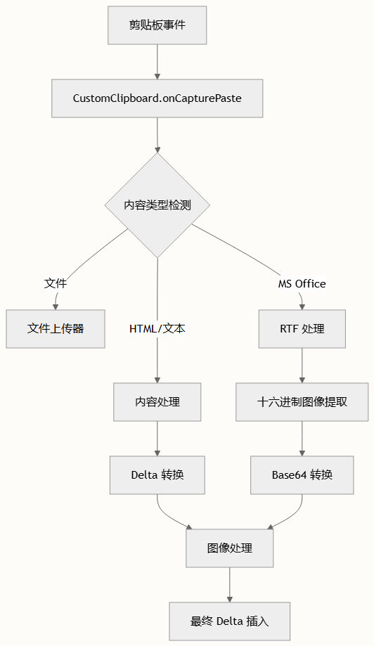

# 剪贴板与粘贴处理

FluentEditor 通过其 CustomClipboard 模块提供了全面的剪贴板和粘贴处理功能，扩展了 Quill 的默认剪贴板功能，以处理复杂的内容类型、图像处理和跨应用程序兼容性。

## 架构概述

剪贴板系统围绕 CustomClipboard 类构建，该类继承自 Quill 的基础剪贴板模块，并为各种粘贴场景添加了专门的处理：



## 核心剪贴板操作

### 复制处理

复制过程通过特殊处理代码内容和 IE11 兼容性得到增强。复制内容时，系统：

- 从代码块中移除不间断空格（`\u00A0`）以保持格式
- 为旧版浏览器提供备用剪贴板数据处理
- 同时维护 HTML 和纯文本格式以实现最大兼容性

### 粘贴处理管道

粘贴操作遵循一个复杂的管道，处理多种内容类型：

1. 初始捕获 - 拦截粘贴事件并提取可用的数据格式
2. 内容类型检测 - 识别粘贴内容是否包含文件、HTML、文本或 RTF 数据
3. 特殊应用程序处理 - 检测并处理来自 Microsoft Office 应用程序的内容
4. 图像处理 - 处理各种图像格式，包括 RTF 十六进制编码图像

> 系统通过特定的元标记自动检测 Microsoft Excel 和 Word 内容，并为每种应用程序类型应用相应的处理。

## 图像处理能力

### RTF 图像提取

对于从 Microsoft Word 粘贴的内容，剪贴板系统可以提取 RTF 格式嵌入的图像：

```typescript
// 从 RTF 数据中提取十六进制编码的图像
extractImageDataFromRtf(rtfData) {
  const regexPictureHeader = /{\\pict[\s\S]+?\\bliptag-?\d+(\\blipupi-?\d+)?({\\\*\\blipuid\s?[\da-fA-F]+)?[\s}]*?/
  // 从十六进制数据处理 PNG 和 JPEG 图像
}
```

提取过程将十六进制编码的图像数据转换为 base64，以便在编辑器中正确显示。

### 文件上传集成

当在粘贴内容中检测到图像时，系统与自定义上传器模块集成：

- 本地文件：通过上传器模块直接上传
- 网络图像：在可访问时保留为 URL
- 失败的图像：替换为错误占位符以保持内容结构

### 自定义粘贴回调

系统通过 editorPaste 配置选项支持自定义粘贴处理：

```typescript
interface EditorPasteConfig {
  observers: Array<{
    callback: ({ code, message, data }) => void
  }>
}
```

这允许开发者实现自定义图像处理工作流，如服务器端上传或图像优化。

## 内容清理和优化

### 空白字符处理

剪贴板系统包括复杂的空白字符处理：

- 前导空白：转换为不间断空格以保持缩进 custom-clipboard.ts#L437-L451
- 颜色对比度：当文本颜色与编辑器背景匹配时自动移除文本颜色以防止不可见文本 custom-clipboard.ts#L456-L472

## 性能优化

对于大量内容粘贴，系统实现了加载指示器和性能优化：

- Delta 限制：超过 2000 个操作的内容触发加载指示器
- 异步处理：图像处理和文件上传异步处理以防止 UI 阻塞

## Microsoft Office 集成

### Excel 内容处理

当检测到 Excel 内容时，系统应用特殊样式渲染以保持格式：

```typescript
function renderStyles(html) {
  // 将内部样式转换为内联样式
  // 处理 CSS 规则并应用到元素
}
```

此函数确保 Excel 的样式在粘贴到编辑器时得到正确维护。

## Word 文档兼容性
剪贴板系统包括对 Word 文档的特殊处理：

- RTF 处理：从 RTF 数据中提取图像和格式
- 元标记检测：通过生成器元标记识别 Word 内容

## 配置选项

### MIME 类型支持

编辑器支持广泛的文件类型配置：

| 类别 | 支持的类型 |
| -- | -- |
| 图像 | PNG, JPEG, GIF, SVG |
| 文档 | Word, Excel, PowerPoint 格式 |
| 媒体 | 音频和视频文件 |
| 存档 | ZIP, TAR, RAR, 7Z |

### 自定义上传器集成

剪贴板系统与 FileUploader 类 custom-uploader.ts 集成，处理文件上传，具有：

- 文件验证：MIME 类型和大小检查
- 异步上传：基于 Promise 的上传处理
- 错误处理：上传失败时的优雅回退

## 使用示例

### 基本剪贴板配置

```typescript
const editor = new FluentEditor('#editor', {
  modules: {
    clipboard: {
      // 自定义剪贴板选项
    },
    uploader: {
      mimetypes: ['image/png', 'image/jpeg'],
      handler: async (range, files) => {
        // 自定义上传逻辑
        return uploadFiles(files);
      }
    }
  }
});
```

### 自定义粘贴处理器

```typescript
const editor = new FluentEditor('#editor', {
  editorPaste: {
    observers: [{
      callback: ({ code, message, data }) => {
        if (code === 0) {
          // 处理成功粘贴
          console.log('粘贴的图像:', data.imageUrls);
        }
      }
    }]
  }
});
```

## 错误处理和回退

剪贴板系统包括强大的错误处理：

- 跨域图像：当网络图像加载失败时回退到剪贴板文件 custom-clipboard.ts#L354-L365
- 无效内容：为失败的图像处理提供错误占位符
- 旧版浏览器支持：通过回退机制保持与 IE11 的兼容性

> 始终在不同浏览器和内容来源上测试剪贴板功能，因为行为可能在应用程序和平台之间有显著差异。

## 集成点

剪贴板系统与多个其他 FluentEditor 模块集成：

- 自定义上传器：处理粘贴内容中的文件上传
- I18N：提供本地化错误消息和加载指示器
- 表格操作：粘贴操作期间对表格内容的特殊处理

有关相关功能的更多信息，请参见 [图像和媒体处理](./image-and-media-handling.md) 和 [协作编辑后端集成](./collaborative-editing-backend-integration.md)。
