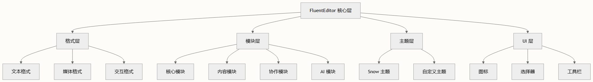

# 核心架构与设计原则

TinyEditor 构建于精密的模块化架构之上，该架构在扩展 Quill 2.0 基础的同时，保持了清晰的关注点分离和高扩展性。这种设计使开发者能够以最少的配置创建强大的富文本编辑体验。

## 架构基础

### 基于继承的扩展模式

其核心在于，TinyEditor 遵循**基于继承的扩展模式**，主要的 `TinyEditor` 类扩展了 Quill 的基础功能。这种方法使 TinyEditor 能够继承 Quill 所有强大的编辑功能，同时添加增强特性和自定义选项。

```typescript
class TinyEditor extends Quill {
  isFullscreen: boolean = false
  declare options: IEditorConfig & ExpandedQuillOptions
  declare uploader: FileUploader 
}
```

### 模块化注册系统

该架构采用**全面的模块化注册系统**，支持动态组件加载和配置。该系统注册四个主要类别：

- Attributors：样式和格式定义
- Formats：自定义内容类型和渲染
- Modules：功能扩展（工具栏、剪贴板等）
- Themes：视觉呈现层

## 设计原则

### 1. 关注点分离

TinyEditor 在不同架构层之间保持严格分离：

| 层级 | 职责 | 示例组件 |
| -- | -- | -- |
| 核心层 | 基础编辑功能	| `TinyEditor` 类、Quill 继承 |
| 格式层 | 内容表示 | `EmojiBlot`、`Video`、`StrikeBlot` |
| 模块层 | 功能扩展	| `Counter`、`CustomClipboard` |
| 主题层 | 视觉呈现	| `SnowTheme` |
| UI 组件层 | 交互元素 | `Icons`、`ColorPicker`、`Picker` |

### 2. 配置驱动架构

系统使用**类型安全的配置接口**，在扩展 Quill 选项的同时保持向后兼容性：

```typescript
export interface IEditorConfig extends QuillOptions {
  'modules'?: IEditorModules
  'screenshotOnStaticPage'?: boolean
  'scrollingContainer'?: HTMLElement | string | null
  'autoProtocol'?: boolean | string
  'editorPaste'?: any
  'screenshot'?: Partial<ScreenShotOptions>
  'format-painter'?: {
    ignoreFormat?: string[]
  }
}
```

### 3. 可扩展模块系统

**模块系统**提供对功能激活和配置的精细控制。每个模块可以：

- 启用/禁用，使用布尔标志
- 配置，使用部分选项
- 自定义，通过扩展点

## 模块架构概览



### 核心模块类别

1. **内容创建模块**：AI 辅助、数学公式、表情符号
2. **媒体处理模块**：图片格式化、视频嵌入、文件上传
3. **协作模块**：实时编辑、感知、光标
4. **生产力模块**：语法高亮、快捷键、计数器
5. **高级功能**：思维导图、流程图、提及

## 国际化架构

TinyEditor 实现了**集中化的 i18n 系统**，支持多语言和动态语言切换：

```typescript
I18N.register(
  {
    'en-US': EN_US,
    'zh-CN': ZH_CN,
  },
  true,
)
```

该系统提供：

- **模块化语言包**，适用于不同组件
- **运行时语言切换**，无需重新初始化
- **文本插值**，用于动态内容
- **回退机制**，处理缺失的翻译

## 扩展模式

### 1. 即插即用架构

每个模块遵循**一致的插件模式**，具有标准化接口：

- 注册：`TinyEditor.register()`
- 配置：类型安全的选项接口
- 生命周期钩子：初始化、销毁、更新方法
- 事件集成：兼容 Quill 事件系统

### 2. 格式扩展系统

格式系统通过 Quill 的 Blot 架构允许自定义内容类型：

- 内联格式：文本样式、链接、提及
- 块级格式：分隔符、代码块、引用
- 嵌入格式：图片、视频、交互内容
- 容器格式：表格、列表、自定义容器

> 该架构在保持**向后兼容性**的同时为 Quill 2.0 提供了增强功能。现有的 Quill 实现可以以最少的代码更改迁移到 TinyEditor，并获得访问高级模块和改进用户体验的机会。

## 性能考虑

### 懒加载策略

TinyEditor 实现**基于模块的懒加载**以优化初始包大小和运行时性能。模块仅在以下情况下实例化：

- 在编辑器选项中显式配置
- 被活动功能所需要
- 通过模块 API 访问

### 内存管理

架构包含**适当的清理机制**：

- 编辑器移除时的模块销毁
- 事件监听器清理
- 媒体内容的资源释放
- 长期运行实例的内存泄漏预防

> **基于补丁的依赖管理系统**（使用 pnpm patches）允许对上游 Quill 依赖项进行精确修改，同时保持更新兼容性和减少包大小。

## 开发工作流集成

### TypeScript 优先开发

整个代码库利用**全面的 TypeScript 类型**：

- 接口定义，适用于所有配置选项
- 泛型类型，适用于可扩展组件
- 严格类型检查，适用于模块交互
- IDE 支持，具有自动完成和验证功能

### 测试架构

TinyEditor 包含**多层测试策略**：

- 单元测试，针对单个模块和格式
- 集成测试，针对模块交互
- 端到端测试，针对完整用户工作流
- 视觉回归测试，针对 UI 一致性

这种架构确保 TinyEditor 保持**可维护、可扩展和高性能**，同时提供丰富的开箱即用功能。设计原则使开发者能够根据特定需求自定义编辑器，而不会影响稳定性或用户体验。

## 后续步骤

要了解如何实际使用此架构，请继续阅读：

- [理解 TinyEditor 类结构](./understanding-tiny-editor-class-structure.md) 以获取详细的 API 探索
- [模块注册和配置](./module-registration-and-configuration.md) 以获取实现指导
- [创建自定义模块](./creating-custom-modules.md) 以获取扩展开发指南
