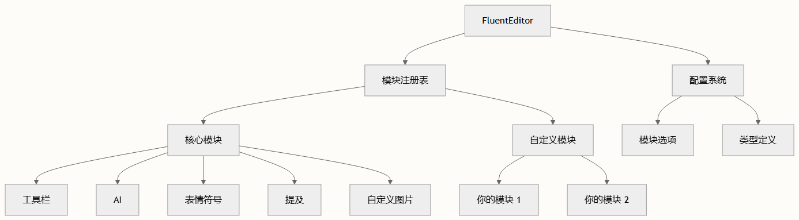

# 创建自定义模块

本文档提供了在 FluentEditor 中创建自定义模块的全面指导，其基础建立在理解 FluentEditor 类结构和模块注册与配置之上。

## 模块架构概述

FluentEditor 扩展了 Quill 的模块系统，采用精密的架构实现自定义功能的无缝集成。核心 FluentEditor 类继承自 Quill，为模块开发提供了基础。



## 模块结构模式

### 构造函数模式

所有模块都遵循一致的构造函数模式，接收编辑器实例和配置选项：

```typescript
class CustomModule {
  constructor(
    private quill: FluentEditor,
    public options: CustomModuleOptions,
  ) {
    // 模块初始化逻辑
    this.initializeModule()
  }
  
  private initializeModule() {
    // 设置事件处理程序、UI 元素等
  }
}
```

此模式在现有模块中显而易见，如 AI 模块 ai/index.ts 和表情符号模块 emoji.ts。

### 配置接口模式

每个模块应定义清晰的配置接口，扩展基础模块选项：

```typescript
export interface CustomModuleOptions {
  // 必需配置
  requiredOption: string
  
  // 带默认值的可选配置
  optionalOption?: number
  booleanFlag?: boolean
  
  // 复杂配置对象
  advancedSettings?: {
    property1: string
    property2: boolean
  }
}
```

编辑器的模块接口展示了这些选项如何集成到整体配置系统中。

## 模块注册流程

### 步骤 1：定义模块类

按照既定模式创建模块类：

```typescript
export class MyCustomModule {
  private toolbar: TypeToolbar | undefined
  private isActive = false
  
  constructor(quill: FluentEditor, options: MyCustomModuleOptions) {
    // 如需要，注册工具栏处理程序
    this.toolbar = quill.getModule('toolbar') as TypeToolbar
    if (this.toolbar) {
      this.toolbar.addHandler('myCustomAction', this.handleCustomAction.bind(this))
    }
    
    // 初始化模块状态
    this.setupEventListeners()
  }
  
  private handleCustomAction() {
    // 自定义操作实现
  }
  
  private setupEventListeners() {
    // 设置编辑器事件监听器
    this.quill.on('text-change', this.handleTextChange.bind(this))
  }
  
  private handleTextChange() {
    // 处理文本变更事件
  }
}
```

### 步骤 2：导出模块

通过模块索引 modules/index.ts 导出模块：

```typescript
export * from './my-custom-module'
```

### 步骤 3：向编辑器注册

使用静态 register 方法将模块注册到 FluentEditor 类：

```typescript
import MyCustomModule from './modules/my-custom-module'
 
FluentEditor.register('modules/myCustomModule', MyCustomModule)
```

## 模块集成模式

### 工具栏集成

需要工具栏集成的模块应遵循 AI 模块建立的模式 ai/index.ts：

```typescript
constructor(quill: FluentEditor, options: AIOptions) {
  this.quill = quill
  this.toolbar = quill.getModule('toolbar') as TypeToolbar
  
  if (typeof this.toolbar !== 'undefined') {
    this.toolbar.addHandler('ai', this.showAIInput.bind(this))
  }
}
```

### 事件驱动架构

利用 FluentEditor 的事件系统实现响应式模块行为：

```typescript
private setupEventListeners() {
  // 选择变更事件
  this.quill.on('selection-change', this.handleSelectionChange.bind(this))
  
  // 文本变更事件
  this.quill.on('text-change', this.handleTextChange.bind(this))
  
  // 自定义事件
  this.quill.on('custom-event', this.handleCustomEvent.bind(this))
}
```

### UI 组件管理

对于包含 UI 组件的模块，遵循表情符号模块使用的模式 emoji.ts：

```typescript
private createUIComponent() {
  const container = document.createElement('div')
  container.classList.add('my-custom-module-container')
  
  // 设置组件结构
  this.setupComponentEvents(container)
  
  return container
}
 
private setupComponentEvents(element: HTMLElement) {
  element.addEventListener('click', this.handleComponentClick.bind(this))
  
  // 处理外部点击以进行清理
  document.addEventListener('click', this.handleOutsideClick.bind(this))
}
```

## 高级模块功能

### 格式集成

引入新内容格式的模块应注册自定义 blots，类似于 Mention 模块 mention/mention.ts：

```typescript
static register() {
  Quill.register(CustomFormatBlot)
}
```

### 异步操作

对于需要异步操作的模块，实现适当的错误处理和加载状态：

```typescript
private async performAsyncOperation() {
  try {
    this.setLoadingState(true)
    const result = await this.apiCall()
    this.handleSuccess(result)
  } catch (error) {
    this.handleError(error)
  } finally {
    this.setLoadingState(false)
  }
}
```

### 国际化支持

与 i18n 系统集成以支持多语言：

```typescript
private getLocalizedText(key: string) {
  return this.quill.getLangText(key)
}
```

## 模块配置选项

### 配置层次结构

| 配置级别 | 范围 | 示例 |
| -- | -- | -- |
| 全局 | 编辑器范围 | modules.myCustomModule.enabled |
| 模块 | 模块特定 | modules.myCustomModule.customOption |
| 运行时 | 动态 | module.updateConfig(newOptions) |

### 默认选项模式

建立合理的默认值，同时允许自定义：

```typescript
const DEFAULT_OPTIONS: MyCustomModuleOptions = {
  enabled: true,
  maxItems: 10,
  theme: 'light',
  position: 'bottom'
}
 
constructor(quill: FluentEditor, options: MyCustomModuleOptions = {}) {
  this.options = { ...DEFAULT_OPTIONS, ...options }
}
```

## 模块生命周期管理

### 初始化

- 构造函数设置：初始化核心属性和引用
- 事件注册：设置事件监听器和处理程序
- UI 创建：创建和配置 UI 组件
- 状态初始化：设置初始模块状态

### 运行时管理

```typescript
// 启用/禁用功能
public setEnabled(enabled: boolean) {
  this.isEnabled = enabled
  this.updateUIState()
}
 
// 更新配置
public updateConfig(newOptions: Partial<MyCustomModuleOptions>) {
  this.options = { ...this.options, ...newOptions }
  this.applyNewConfiguration()
}
```

### 清理

实现适当的清理以防止内存泄漏：

```typescript
public destroy() {
  // 移除事件监听器
  this.quill.off('selection-change', this.handleSelectionChange)
  
  // 移除 UI 元素
  if (this.uiElement) {
    this.uiElement.remove()
  }
  
  // 清除引用
  this.quill = null
  this.uiElement = null
}
```

## 最佳实践和指南

### 性能考虑

> 对昂贵操作进行防抖处理，并使用高效的事件处理模式以保持编辑器性能，特别是对于响应频繁文本变更的模块。

### 错误处理

实现全面的错误处理：

```typescript
private safeExecute(operation: () => void, fallback?: () => void) {
  try {
    operation()
  } catch (error) {
    console.error('Module operation failed:', error)
    fallback?.()
  }
}
```

### 类型安全

利用 TypeScript 进行健壮的模块开发：

```typescript
interface MyCustomModuleState {
  isActive: boolean
  currentSelection: Range | null
  pendingOperations: Promise<any>[]
}
```

## 测试模块

### 单元测试结构

```typescript
describe('MyCustomModule', () => {
  let quill: FluentEditor
  let module: MyCustomModule
  
  beforeEach(() => {
    quill = new FluentEditor('#test-container')
    module = new MyCustomModule(quill, testOptions)
  })
  
  it('should initialize correctly', () => {
    expect(module).toBeDefined()
    expect(module.options).toEqual(expectedOptions)
  })
})
```

## 集成示例

### 简单模块示例

```typescript
export class SimpleCounterModule {
  private count = 0
  
  constructor(quill: FluentEditor) {
    quill.on('text-change', () => {
      this.count = quill.getLength() - 1 // 减去 1 以去除尾随换行符
      this.updateDisplay()
    })
  }
  
  private updateDisplay() {
    const counter = document.querySelector('.word-counter')
    if (counter) {
      counter.textContent = `Words: ${this.count}`
    }
  }
}
```

### 复杂模块示例

对于更复杂的模块，如 AI 助手 ai/index.ts，考虑：

- 异步 API 集成
- 复杂 UI 状态管理
- 多种交互模式
- 错误恢复机制

## 后续步骤

创建自定义模块后，你可能想探索：

- [自定义格式开发](./custom-format-development.md) 以扩展内容格式
- [事件系统和钩子](../api/event-system-and-hooks.md) 以实现更深度的集成
- [模块配置选项](../api/options.md) 以了解高级配置模式

FluentEditor 的模块化架构为扩展编辑器功能提供了坚实的基础，同时保持代码质量和性能标准。