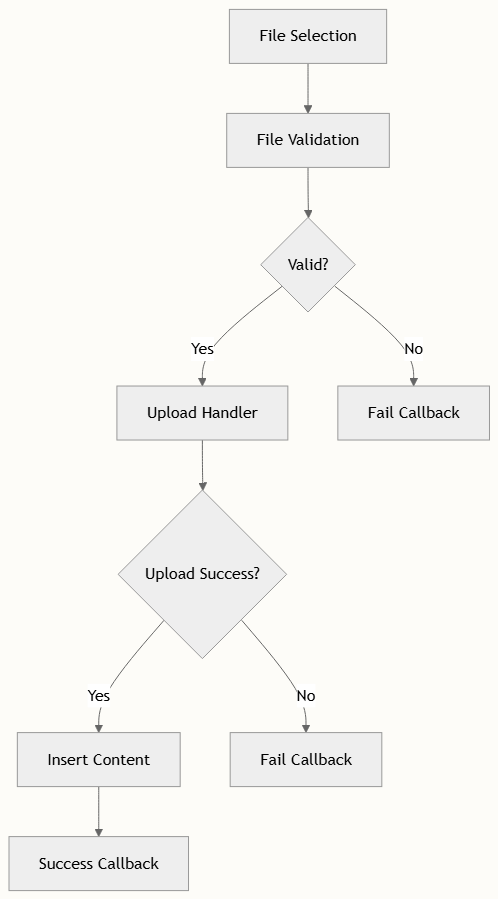

# 图片与媒体处理

FluentEditor 通过模块化架构提供全面的图像和媒体处理功能，支持图片插入、操作、视频嵌入和文件上传。该系统基于 Quill 的 blot 系统构建，并通过自定义扩展实现高级媒体操作。

## 架构概述

图像和媒体处理系统由多个相互连接的模块组成：


## 自定义图像模块

自定义图像模块扩展了 Quill 的嵌入 blot，提供高级图像操作功能。它处理图像插入、调整大小、对齐和工具栏交互。

### 核心 Image Blot

CustomImage 类 image.ts 扩展了 Quill 的嵌入 blot 并提供以下功能：

- 图像创建：支持字符串 URL 和包含对齐、宽度和高度属性的对象配置
- 清理：内置 URL 验证和清理以确保安全性
- 属性管理：处理 alt、height、width 和 image-id 属性
- 格式支持：通过 CSS 类支持左对齐、居中和右对齐

```typescript
export type ImageValue = string | {
  src: string
  align?: string
  height?: number
  width?: number
}
```

### 图像验证和安全

图像系统包括强大的安全措施：

- URL 清理：默认仅允许 http、https、blob 和 data 协议 image.ts
- 模式匹配：验证图像 URL 是否符合 .jpg、.jpeg、.gif、.png 和 base64 模式 image.ts
- 无效 URL 处理：将无效 URL 转换为 //:0 占位符，可选择为 Electron 等特殊环境进行覆盖

### Blot Formatter 系统

BlotFormatter 类 blot-formatter.ts 提供交互式图像操作：

- 调整大小句柄：可拖动句柄用于调整图像大小
- 工具栏系统：包含对齐、复制和下载操作的上下文工具栏
- 覆盖层管理：操作期间的视觉反馈覆盖层
- 操作系统：可扩展的操作框架用于自定义图像操作

### 配置选项

图像模块通过 BlotFormatterOptions options.ts 高度可配置：

| 选项 | 类型 | 默认值 | 描述 |
| -- | -- | -- | -- |
| allowInvalidUrl | boolean | false | 允许本地文件路径（安全考虑） |
| overlay.className | string | 'blot-formatter__overlay' | 操作覆盖层的 CSS 类 |
| toolbar.buttons | object | alignment + copy + download | 可用的工具栏操作 |
| resize.handleClassName | string | 'blot-formatter__resize-handle' | 调整大小句柄的 CSS 类 |

## 视频支持

FluentEditor 通过 Video blot 类 video.ts 包含原生视频支持：

## 视频功能

- 块级嵌入：视频被视为块级元素
- 属性支持：处理 id、title 和 src 属性
- 协议安全：与图像相同的清理规则
- 控件：自动添加视频控件用于播放

### 视频配置

```typescript
const videoAttributes = ['id', 'title', 'src']
const protocolWhitelist = ['http', 'https', 'blob']
```

## 文件上传系统

FileUploader 类 custom-uploader.ts 提供全面的文件处理：

### 上传工作流



### 文件类型检测

系统自动检测和处理不同的文件类型：

| 文件类型 | MIME 模式 | 插入为 |
| -- | -- | -- |
| 图像 | `image/*` | Image blot |
| 视频 | `video/*` | Video blot |
| 其他文件 | `*/*` | 带大小显示的文件链接 |

### 上传配置

```typescript
export interface FileUploaderOptions {
  mimetypes: string[]
  maxSize: number
  handler: (range: Range, files: File[]) => Promise<(string | false)[]>
  success: (file: File, range: Range) => void
  fail: (file: File, range: Range) => void
}
```

> 上传处理器可以返回成功上传的 URL 或失败上传的 false。系统优雅地处理混合结果，插入成功的内容同时为其他内容调用失败回调。

## 文件模块

文件模块通过 File blot 提供额外的文件处理功能：

### 文件显示功能

- 可视化表示：文件显示为可点击的链接，带有文件图标
- 大小显示：自动文件大小计算和以 KB 为单位的格式化
- 下载支持：文件在新标签页中打开以供下载
- 元数据存储：存储文件大小、标题和修改日期

### 文件格式结构

```typescript
export interface FileValue {
  size: number
  src: string
  title: string
}
```

## 安全考虑

媒体处理系统包括多个安全层：

- URL 清理：所有媒体 URL 都根据协议白名单进行验证
- 文件验证：上传前的 MIME 类型和大小验证
- 内容安全：自动清理嵌入内容
- 安全默认值：默认禁用本地文件路径

> 在 Electron 等环境中使用 allowInvalidUrl: true 时，请确保适当的文件访问控制已就位，以防止未经授权的本地文件暴露。

## 集成点

媒体系统与其他 FluentEditor 模块无缝集成：

- 剪贴板模块：处理图像和文件的粘贴操作
- 工具栏模块：提供媒体插入控件
- AI 模块：可以处理和增强媒体内容
- 协作编辑：跨用户同步媒体更改

## 后续步骤

要充分利用媒体处理功能，请探索这些相关主题：

- [模块注册和配置](./module-registration-and-configuration.md) 用于设置媒体模块
- [剪贴板和粘贴处理](./clipboard-and-paste-processing.md) 用于媒体粘贴处理
- [自定义格式开发](./custom-format-development.md) 用于创建自定义媒体格式
- [FluentEditor API 方法](../api/fluent-editor-instance.md) 用于编程媒体操作
