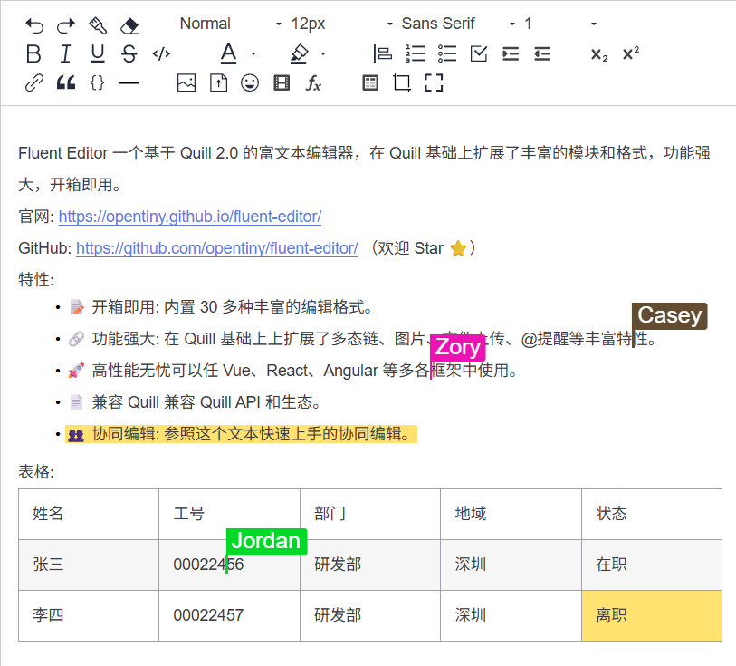

# 安装与配置

本指南涵盖了 TinyEditor 的完整安装和设置过程，TinyEditor 是一款基于 Quill 2.0 的富文本编辑器，具有扩展模块和格式。TinyEditor 框架无关，兼容 Quill 的 API 和生态系统。

## 系统要求

安装 TinyEditor 前，请确保你的开发环境满足以下要求：

- Node.js: 16.0 版本或更高版本
- 包管理器: pnpm（推荐）、npm 或 yarn
- 浏览器: 支持 ES6+ 特性的现代浏览器

## 安装方法

### 1. NPM 包安装

将 TinyEditor 添加到项目的最简单方法是通过 npm：

```bash
npm i @opentiny/fluent-editor
```

这将安装 TinyEditor 的最新稳定版本及其所有核心模块和格式。

### 2. 开发环境设置

对于希望贡献或修改 TinyEditor 的开发者：

```bash
git clone git@github.com:opentiny/tiny-editor.git
cd tiny-editor
pnpm i
pnpm dev
```

开发服务器将在 http://localhost:5173/tiny-editor/ 启动。

## 项目架构

TinyEditor 采用多包 monorepo 结构：


## 包结构

| 包 | 用途 |
| -- | -- |
| fluent-editor	| 核心编辑器库 |
| docs | 文档和示例 |
| projects | 演示应用 |
| collaborative-editing-backend	| 实时协作服务器 |

## 基础集成

### HTML 设置

为你的编辑器创建容器元素：

```html
<div id="editor">
  <p>Hello TinyEditor!</p>
</div>
```

### CSS 导入

在你的 CSS 或 SCSS 文件中导入 TinyEditor 样式：

```css
@import '@opentiny/fluent-editor/style.css';
```

> style.css 文件在构建过程中自动生成，包含编辑器及其模块的所有必要样式。

### JavaScript 初始化

导入并初始化 TinyEditor：

```javascript
import TinyEditor from '@opentiny/fluent-editor'
 
const editor = new TinyEditor('#editor', {
  theme: 'snow',
})
```

## 模块注册

TinyEditor 在初始化期间自动注册所有可用模块：

```javascript
FluentEditor.register({
  'formats/emoji': EmojiBlot,
  'formats/divider': DividerBlot,
  'modules/clipboard': CustomClipboard,
  'modules/counter': Counter,
  'modules/emoji': EmojiModule,
  'modules/file': FileModule,
  'modules/i18n': I18N,
  'modules/image': BlotFormatter,
  'modules/mathlive': MathliveModule,
  'modules/ai': AI,
  'modules/mention': Mention,
  'modules/syntax': Syntax,
  'modules/toolbar': BetterToolbar,
  'modules/uploader': FileUploader,
  'modules/shortcut-key': ShortCutKey,
  'modules/mind-map': MindMapModule,
  'modules/flow-chart': FlowChartModule,
  'themes/snow': SnowTheme,
  'ui/icons': Icons,
  'ui/picker': Picker,
  'ui/color-picker': ColorPicker,
}, true)
```

## 构建配置

### 开发构建

用于热重载的开发：

```bash
pnpm -F @opentiny/fluent-editor dev
```

### 生产构建

构建用于分发的库：

```bash
pnpm -F @opentiny/fluent-editor build
```

构建过程创建多种格式：

- ES 模块: `dist/es/` 目录
- CommonJS: `dist/lib/` 目录
- 类型定义: `dist/types/` 目录
- 样式: `dist/style.css`

## 工作区管理

TinyEditor 使用 pnpm workspaces 进行包管理：

```yaml
packages:
  - packages/*
```

可用工作区脚本：

| 脚本 | 描述 |
| -- | -- |
| pnpm dev | 启动文档站点 |
| pnpm watch | 监听库的变更 |
| pnpm dev:projects | 启动示例项目 |
| pnpm build | 构建文档 |
| pnpm build:lib | 构建用于分发的库 |
| pnpm pub | 发布库到 npm |

## 依赖

### 核心依赖

TinyEditor 通过附加模块扩展 Quill：

```json
{
  "dependencies": {
    "lodash-es": "^4.17.15",
    "quill": "^2.0.0",
    "quill-easy-color": "^0.0.10",
    "quill-shortcut-key": "^0.0.5"
  }
}
```

### 开发依赖

构建系统包含用于 TypeScript、测试和打包的综合工具。

## 下一步

完成安装和设置后：

1. 探索 [快速入门](./quick-start.md) 了解基本用法示例
2. 查看 [基本用法示例](./basic-usage-examples.md) 了解实际实现
3. 设置你的 [开发环境](./development-environment-setup.md) 进行自定义开发
4. 理解 [核心架构](./core-architecture-and-design-principles.md) 进行高级定制


