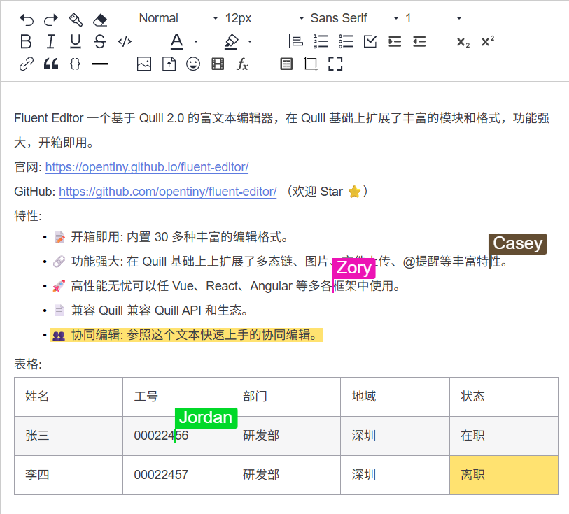
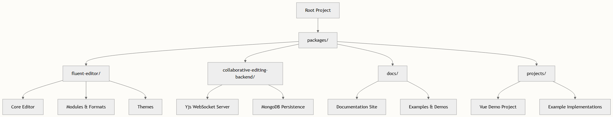
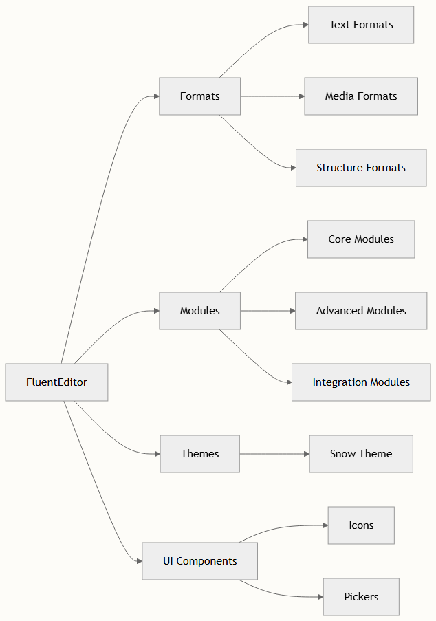

# 简介

TinyEditor 是一个基于 Quill 2.0 构建的强大富文本编辑器，通过全面的模块和格式扩展了基础功能。本概述介绍了项目架构、关键特性和结构，帮助初学者开发者了解 TinyEditor 提供的功能以及如何开始使用。

## 什么是 TinyEditor？

TinyEditor 是一个框架无关的富文本编辑器，通过 30 多个额外的模块和格式增强了 Quill 2.0。它基于 Quill 生态系统，在保持完整 API 兼容性的同时，添加了强大的功能，如高级表格操作、图像处理、协作编辑、AI 集成等。该编辑器设计为与 Vue、React、Angular 及其他 Web 框架无缝协作。



## 项目架构

项目采用 pnpm workspaces 的 monorepo 结构，按不同关注点组织成独立的包：



### 核心包

| 包 | 用途	| 主要内容 |
| -- | -- | -- |
| fluent-editor | 主编辑器库 | 核心 FluentEditor 类、模块、格式、主题 |
| collaborative-editing-backend	| 实时协作服务器 | WebSocket 服务器、MongoDB 持久化、Yjs 集成 |
| docs | 文档和示例	| 文档站点、演示场、示例 |
| projects | 演示应用 | Vue 演示、实现示例 |

## 关键特性和模块

TinyEditor 通过一套全面的模块和格式扩展了 Quill，使其开箱即用即可投入生产环境：

### 核心特性

- **30+ 模块和格式**：除了 Quill 的 21 个内置格式，还添加了 15+ 个增强模块，包括表格、图像、链接、计数器、表情符号、文件、剪贴板、提及、快速菜单和截图功能
- **高级表格操作**：插入自定义尺寸表格、拖动行列大小、插入/删除行列、合并/拆分单元格
- **框架无关**：兼容 Vue、React、Angular 和原生 JavaScript
- **完全 Quill 兼容**：与 Quill API 和生态系统模块保持 100% 兼容性

### 模块架构

编辑器按几个关键模块类别组织：



## 技术栈

### 核心依赖

- **Quill 2.0**：基础富文本编辑器引擎
- **TypeScript**：完整类型安全和开发体验
- **Vite**：用于开发和打包的现代构建工具
- **Sass**：主题的 CSS 预处理

### 高级功能支持

- **Yjs**：实时协作编辑框架
- **MongoDB**：协作的文档持久化
- **WebSocket**：实时通信
- **Emoji Mart**：表情符号选择和插入
- **Highlight.js**：代码语法高亮
- **MathLive**：LaTeX 数学公式支持

## 快速开始

体验 TinyEditor 最快的方式是通过开发环境：

1. 克隆和安装：

```bash
git clone git@github.com:opentiny/tiny-editor.git
cd tiny-editor
pnpm i
```

2. 启动开发：

```bash
pnpm dev
```

3. 查看示例：访问 http://localhost:5173/tiny-editor/

生产环境使用，请安装包：

```bash
npm i @opentiny/fluent-editor
```

## 项目结构深入解析

### 源码组织

主编辑器源码结构如下：

- `src/core/`：扩展 Quill 的核心 FluentEditor 类
- `src/modules/`：所有功能模块（工具栏、剪贴板、AI 等）
- `src/formats/`：自定义内容格式和 blot
- `src/attributors/`：样式和属性定义
- `src/themes/`：视觉主题实现
- `src/config/`：配置类型和国际化

### 模块注册系统

TinyEditor 使用复杂的模块注册系统，支持轻松扩展和定制。所有模块在主入口点注册，具有覆盖能力，使开发者能够自定义或替换任何组件。

## 后续步骤

现在你已了解项目概述，继续你的学习之旅：

- [快速开始](./quick-start.md)：通过基础编辑器设置和使用获得实践经验
- [安装和设置](./installation-and-setup.md)：不同环境的详细安装指南
- [核心架构和设计原则](./core-architecture-and-design-principles.md)：深入技术架构

模块化设计和全面的功能集使 TinyEditor 适用于从简单内容编辑到复杂协作应用的各种场景。项目对 Quill 兼容性的承诺确保你可以利用整个 Quill 生态系统，同时享受 TinyEditor 的增强功能。
