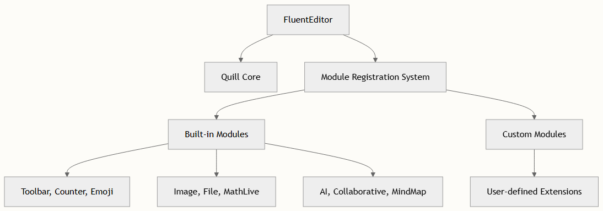

# 模块注册与配置

FluentEditor 提供了一个精密的模块系统，在保持与核心架构完全兼容的同时扩展了 Quill 的功能。理解模块如何注册和配置对于充分利用编辑器潜力及创建自定义扩展至关重要。

## 模块架构概述

FluentEditor 的模块系统基于 Quill 的模块注册机制构建，但引入了增强的配置选项和针对富文本编辑场景的专用模块。FluentEditor 类扩展了 Quill 并继承了其模块注册能力。



## 模块注册流程

### 静态注册方法

`FluentEditor.register()` 方法提供了一种静态方式来在编辑器实例化前注册模块：

```typescript
// Register custom modules
FluentEditor.register('modules/custom-module', CustomModule);
FluentEditor.register('formats/custom-format', CustomFormat);
```

该方法委托给 Quill 的注册系统，确保与底层架构的兼容性。

### 模块导入系统

所有内置模块都通过集中的模块索引导出 modules/index.ts，使其易于注册：

```typescript
export * from './collaborative-editing'
export * from './counter'
export * from './custom-clipboard'
export * from './custom-image'
export * from './custom-uploader'
// ... other modules
```

## 配置接口

### IEditorModules 接口

模块配置通过 IEditorModules 接口定义，为所有可用模块提供了全面的选项：

| Module | Type |
| -- | -- |
| toolbar	| `boolean \| ToolbarOptions` |
| emoji	| `boolean \| EmojiModuleOptions` |
| image	| `boolean \| BlotFormatterOptionsInput` |
| mention	| `boolean \| MentionOption` |
| i18n | `boolean	\| I18NOptions` |
| counter	| `boolean \| ICounterOption` | 

### 编辑器配置结构

完整的编辑器配置扩展了 Quill 的选项，包含 FluentEditor 特定设置：

```typescript
export interface IEditorConfig extends QuillOptions {
  modules?: IEditorModules
  screenshotOnStaticPage?: boolean
  scrollingContainer?: HTMLElement | string | null
  autoProtocol?: boolean | string
  editorPaste?: any
  screenshot?: Partial<ScreenShotOptions>
  format-painter?: {
    ignoreFormat?: string[]
  }
}
```

## 模块实现模式

### 模块类结构

每个模块遵循一致的实现模式。例如，EmojiModule 展示了标准结构：

```typescript
class EmojiModule {
  constructor(quill: FluentEditor, options: EmojiModuleOptions = {}) {
    this.quill = quill
    this.options = { ...DEFAULT_OPTIONS, ...options }
    this.init()
  }
  
  // Public API methods
  public openDialog() { /* ... */ }
  public closeDialog() { /* ... */ }
  public destroy() { /* ... */ }
  
  // Private implementation methods
  private createPicker() { /* ... */ }
  private handleEmojiSelect() { /* ... */ }
}
```

### 格式模块注册

像 CustomImage 这样的格式模块扩展了 Quill 的 blot 系统并提供静态注册方法：

```typescript
export class CustomImage extends Embed {
  static register() {
    // Register format with Quill
  }
  
  static create(value: ImageValue) {
    // Create blot instance
  }
  
  static formats(domNode: HTMLElement) {
    // Extract format values
  }
}
```

### 工具栏模块增强

BetterToolbar 类通过增强功能扩展了 Quill 的工具栏：

```typescript
export class BetterToolbar extends Toolbar {
  constructor(quill, options) {
    super(quill, options)
    this.enhanceFunctionality()
  }
  
  update(range) {
    // Enhanced update logic
  }
  
  attach(input: HTMLElement) {
    // Enhanced attachment logic
  }
}
```

## 配置示例

### 基础模块配置

```typescript
const editor = new FluentEditor('#editor', {
  modules: {
    toolbar: [
      ['bold', 'italic', 'underline'],
      ['emoji', 'image'],
      ['clean']
    ],
    emoji: {
      theme: 'light',
      locale: 'zh-CN'
    },
    image: {
      resize: true,
      drag: true
    }
  }
})
```

### 高级模块设置

```typescript
const editor = new FluentEditor('#editor', {
  modules: {
    toolbar: {
      container: [
        [{ 'header': [1, 2, 3, false] }],
        ['bold', 'italic', 'underline'],
        ['emoji', 'image', 'file'],
        [{ 'align': [] }],
        ['clean']
      ],
      handlers: {
        image: this.handleImageUpload
      }
    },
    mention: {
      source: this.searchUsers,
      renderItem: this.renderUserMention
    },
    i18n: {
      lang: 'zh-CN',
      resources: customTranslations
    },
    counter: {
      maxLength: 1000,
      counter: this.updateCounter
    }
  }
})
```

> 模块配置选项与默认值深度合并，允许部分配置，同时为未指定选项保持合理的默认值。

## 模块生命周期管理

### 初始化顺序

模块按照在配置中出现的顺序初始化，确保依赖关系正确建立：

- 核心模块（toolbar、clipboard、history）
- 格式模块（image、file、link）
- 功能模块（emoji、mention、counter）
- 高级模块（AI、collaborative editing）

### 清理和销毁

每个模块都应实现 destroy() 方法来清理资源和事件监听器：

```typescript
public destroy() {
  // Remove event listeners
  this.quill.off('text-change', this.handleTextChange)
  
  // Clean up DOM elements
  if (this.pickerElement) {
    this.pickerElement.remove()
  }
  
  // Clear references
  this.quill = null
}
```

> 移除编辑器实例时始终调用模块的 destroy() 方法，以防止内存泄漏并确保正确清理。

## 后续步骤

理解模块注册和配置后，你可以探索：

- [创建自定义模块](./creating-custom-modules.md) - 学习如何构建自己的模块
- [模块配置选项](../api/options.md) - 所有配置选项的详细参考
- [理解 FluentEditor 类结构](./understanding-tiny-editor-class-structure.md) - 深入了解核心架构

模块系统为扩展 FluentEditor 的功能提供了灵活的基础，同时保持所有模块之间清晰的关注点分离和一致的 API 模式。