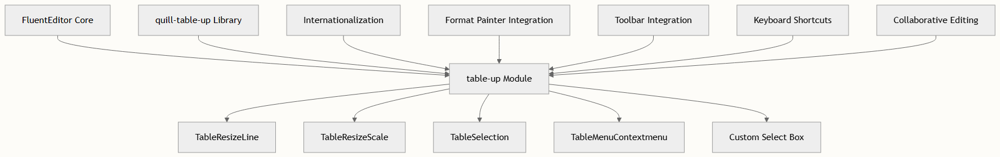

# 表格操作与管理

FluentEditor 通过 table-up 模块提供全面的表格功能，扩展了 Quill 原生的表格能力，支持高级操作、自定义选项以及与编辑器生态系统的无缝集成。该模块提供专业级表格管理功能，适用于文档编辑、数据展示和协作工作流。

## 架构概述

表格操作系统基于模块化架构构建，集成了多个专业组件以处理不同方面的表格功能：



`table-up` 模块作为 `quill-table-up` 库的增强封装器，添加了 FluentEditor 特有功能，如国际化支持、格式刷集成和无缝主题兼容性。

## 核心功能

### 表格创建和配置

表格系统支持快速插入和自定义配置选项：

#### 快速表格创建

- 全宽表格：即时插入跨越整个编辑器宽度的表格
- 自定义尺寸：通过直观的对话框界面精确控制行列数量

#### 配置选项

- 支持正整数验证的自定义表格尺寸
- 灵活的宽度模式（基于百分比和固定宽度）
- 当百分比约束不足时自动转换宽度

### 单元格操作

全面的单元格操作功能支持复杂的表格编辑：

#### 基本单元格操作

- 复制和粘贴单元格内容并保持格式
- 剪切单元格并集成剪贴板功能
- 四个方向的插入操作（上、右、下、左）

#### 高级单元格管理

- 将多个选中的单元格合并为统一单元格
- 将合并的单元格拆分为独立单元
- 带确认提示的整行或整列删除

#### 样式和外观

- 支持透明度的背景颜色自定义
- 用于视觉区分的边框颜色配置
- 集成预设和自定义选项的颜色选择器

### 交互功能

表格模块包含多项交互增强功能：

#### 调整大小功能

- 基于线条的调整：拖动表格边框调整尺寸
- 基于比例的调整：整个表格的比例缩放
- 调整操作期间的视觉反馈

#### 选择系统

- 支持键盘和鼠标的多单元格选择
- 可视化选择指示器
- 基于选择状态的上下文相关菜单选项

#### 上下文菜单集成

- 右键上下文菜单提供相关操作
- 基于当前选择的动态菜单项
- 为高级用户显示键盘快捷键指示器

## 实现细节

### 模块注册和配置

表格模块需要正确的注册和配置：

```typescript
// 导入所需组件
import { createSelectBox, defaultCustomSelect, TableMenuContextmenu, TableResizeLine, TableResizeScale, TableSelection, TableUp } from 'quill-table-up'
import { generateTableUp, generateTableUpShortKeyMenu } from '@opentiny/fluent-editor'
 
// 注册增强表格模块
FluentEditor.register({ 
  'modules/table-up': generateTableUp(TableUp) 
}, true)
 
// 配置子模块
'table-up': {
  customSelect: defaultCustomSelect,
  modules: [
    { module: TableResizeLine },
    { module: TableResizeScale },
    { module: TableSelection },
    { module: TableMenuContextmenu },
  ],
}
```

### 国际化支持

模块为所有面向用户的文本提供全面的 i18n 支持：

#### 支持的语言

- 英语 (en-us)
- 中文 (zh-cn)

#### 本地化元素

- 对话框标签和按钮
- 错误消息和验证文本
- 上下文菜单项
- 工具提示描述

国际化系统在语言更改时动态更新文本，确保跨语言环境的一致用户体验。

### 格式刷集成

表格模块与 FluentEditor 的格式刷无缝集成：

```typescript
// 自动格式刷配置
this.quill.options['format-painter'].ignoreFormat = Array.from(
  new Set([
    ...currentIgnoreFormat,
    'table-up-cell-inner', // 排除内部表格结构
  ]),
)
```

此集成防止复制不需要的内部表格结构格式，同时允许在表格单元格之间正确传递格式。

## API 参考

### 配置选项

| 选项 | 类型 | 默认值 | 描述 |
| -- | -- | -- | -- |
| customSelect | Object | defaultCustomSelect | 表格插入的自定义选择框配置 |
| modules | Array | 必需 | 要启用的表格操作模块数组 |
| texts | Object | 自动解析 | 国际化的自定义文本覆盖 |

### 可用模块

| 模块 | 用途 | 功能 |
| -- | -- | -- |
| TableResizeLine | 基于边框的调整 | 拖动单个边框进行精确控制 |
| TableResizeScale | 比例缩放 | 保持宽高比缩放整个表格 |
| TableSelection | 单元格选择 | 带视觉反馈的多单元格选择 |
| TableMenuContextmenu | 右键菜单 | 上下文相关的操作菜单 |

### 键盘快捷键

模块通过 `generateTableUpShortKeyMenu()` 与 FluentEditor 的快捷键系统集成，为常见操作提供键盘访问：

- 单元格导航（方向键）
- 扩展选择（Shift + 方向键）
- 快速操作（Ctrl/Cmd 组合键）

## 集成示例

### 基础表格设置

```typescript
const editor = new FluentEditor('#editor', {
  modules: {
    'table-up': {
      customSelect: defaultCustomSelect,
      modules: [
        { module: TableResizeLine },
        { module: TableSelection },
      ],
    },
  },
})
```

### 协作高级配置

```typescript
'table-up': {
  customSelect: defaultCustomSelect,
  modules: [
    { module: TableResizeLine },
    { module: TableResizeScale },
    { module: TableSelection },
    { module: TableMenuContextmenu },
  ],
},
'shortcut-key': {
  menuItems: [tableUpConfig],
  menuKeyboardControls(event, data) {
    return tableUpKeyboardControl(event, data)
  },
},
```

## 最佳实践

### 性能优化

- 仅启用必需模块以减少打包体积
- 对大型表格使用防抖调整大小处理器
- 为复杂表格操作实现懒加载

### 用户体验

- 为所有操作提供视觉反馈
- 对破坏性操作使用确认对话框
- 为表格修改实现撤销/重做支持

### 协作编辑

表格模块完全兼容协作编辑功能，允许多用户：

- 同时编辑不同单元格
- 观察实时表格结构更改
- 跨会话保持一致的表格状态

## 故障排除

### 常见问题

#### 表格无响应

- 验证所有必需模块已注册
- 检查与表格样式的 CSS 冲突
- 确保容器尺寸正确

#### 调整大小不工作

- 确认 TableResizeLine 或 TableResizeScale 模块已加载
- 检查冲突的鼠标事件处理器
- 验证容器具有明确的宽度/高度

#### 选择问题

- 确保 TableSelection 模块已启用
- 检查 CSS pointer-events 冲突
- 验证正确的事件绑定

## 后续步骤

要全面了解 FluentEditor 的功能，请探索这些相关主题：

- [模块注册和配置](./module-registration-and-configuration.md) - 了解模块系统架构
- [格式注册和 Blot 系统](./format-registration-and-blot-system.md) - 了解表格格式如何与 Quill 的 blot 系统集成
- [事件系统和钩子](../api/event-system-and-hooks.md) - 发现如何使用自定义事件扩展表格功能
- [协作编辑后端集成](./collaborative-editing-backend-integration.md) - 实现实时协作表格编辑

表格操作系统代表了 FluentEditor 致力于提供专业级文档编辑功能，同时保持开发者对现代富文本编辑器所期望的简单性和可扩展性。
